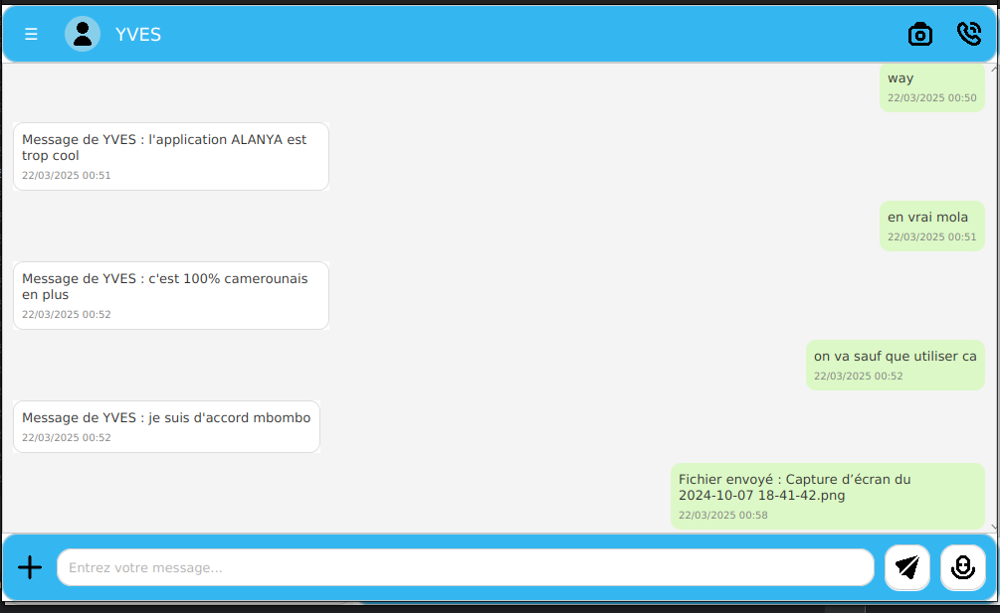
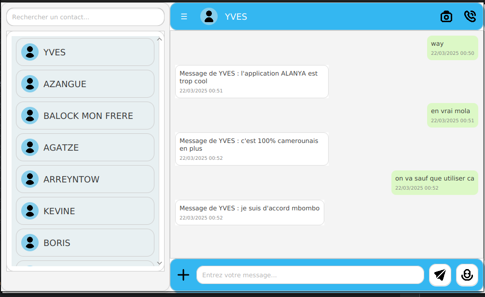

# **Alanya Chat Application**

## 🚀 **Description**
**Alanya** est une application de chat avancée, développée en JavaFX, qui utilise des sockets pour permettre une communication fluide entre les clients et un serveur. Cette plateforme offre une expérience moderne et enrichie pour la messagerie instantanée, le partage de fichiers, et les appels audio/vidéo.

---

## 🌟 **Fonctionnalités**
- 📤 **Messagerie Texte** : Envoi instantané de messages entre utilisateurs (fonctionnalité opérationnelle).
- 🗂️ **Transfert de Fichiers** : Partage rapide et sécurisé de fichiers entre utilisateurs (en développement).
- 📞 **Appels Audio et Vidéo** : Communication en temps réel avec appels audio et vidéo (en cours de développement).
- 🆔 **Identification des Utilisateurs** : Les utilisateurs sont identifiés par leur **nom** et l'**IP de leur machine**.
- 🤝 **Architecture Client-Serveur** : Gestion centralisée des connexions via un serveur Java.
- 🎨 **Interface Moderne** : Interface intuitive avec un design soigné.

---

## 🖼️ **Aperçu de l'Interface**
### **1. Fenêtre Principale de Chat**



### **3. Fenêtre des Paramètres Utilisateur**


Ajoutez vos captures d’écran dans le dossier `screenshots` à la racine du projet.

---

## ⚙️ **Installation et Configuration**

### **1. Prérequis**
- **Java 8+** : Assurez-vous que JDK est installé.
- **Maven** (ou Gradle) : Utilisez-le pour gérer les dépendances (si applicable).

### **2. Cloner le Projet**
```bash
git clone https://github.com/BalaAndegue/ALANYA_PROJECT.git
cd ALANYA_PROJECT
